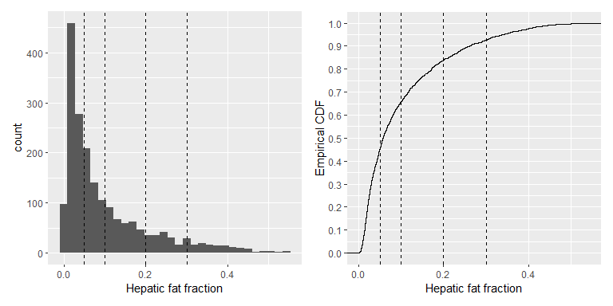
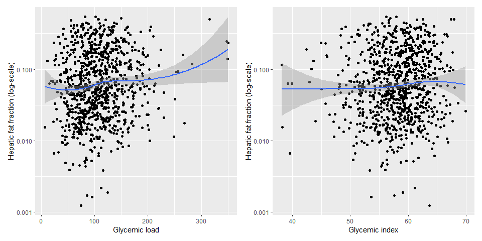

HAT hepatic fat study
================

## Datasets

- A CSV file `HAT_KeyVariables.csv` includes PIDs, their assigned group
  and date randomized, n = 1008

- A CSV file `HAT_HFF.csv` includes PID, MRI dates and 3 variables about
  hepatic fat MRI measurements:

  - `hff`: Hepatic fat fraction
  - `FWHM`: Full width half maximum (the width of the peak measured at
    50% of its maximum height), smaller the better
  - `sn`: Signal/noise ratio, higher the better
  - The file is in long format, having up to 2 MRI measurements per
    subject: n obs = 1932

- Demographic data: A SAS data file
  `final_n961_foodgroups_june2024.sas7bdat`

  - n = 961
  - Includes demographics (age, gender, race, education), BMI, and some
    dietary data

- Dietary data: A CSV file `HAT_GL_GI_by_FG_updated_080224.csv`

  - n.obs = 2845 from n = 961 distinct PIDs
  - Include glycemic load/index from various food groups by subject and
    visit

## Data check on hepatic fat

- The hepatic fat data file `HAT_HFF.csv` includes 1932 MRI measurements
  from 1008 distinct PIDs
  - The file does not have a variable indicating if a measurement is a
    pre- or post-intervention
  - The date of randomization was added from `HAT_KeyVariables.csv` to
    determine pre/post measurements
- Most of the subjects (n = 924) have two MRI measurements:
  - There were 3 subjects who have 2 measurements **after**
    randomization **\[Decision needed\]**
- There are 81 subjects who have only one MRI measurement
  - Among them, 75 subjects have only pre-intervention measurement
    **\[Decision needed\]**
  - Six subjects have only post-measurement **\[Decision needed\]**
- There are 3 subjects who did not have any MRI measurements (i.e., MRI
  date missing, measurement missing)

## Preliminary analysis on hepatic fat measurements

- Disclaimer: The following analysis was done regardless of pre/post
  measurements

- Descriptive statistics on `hff`, `FWHM`, `sn`:

  - The HFF value ranges from 0.04% to 54%, with mean of 10% (median
    5.7%)
    - Its distribution appears to be very right-skewed
  - ~~Note the negative value of -1 on S/N ratio – what does this
    indicate? **\[Clarify\]**~~
  - ~~There are 7 MRI measurements that have a value `-1` on S/N ratio~~
  - The issue of S/N = -1 has been resolved – see the email
    correspondence on 1/27/25

<!-- -->

    ##       hff                 FWHM             sn        
    ##  Min.   :0.0004123   Min.   :0.117   Min.   :  19.0  
    ##  1st Qu.:0.0247974   1st Qu.:0.252   1st Qu.: 204.0  
    ##  Median :0.0568708   Median :0.299   Median : 321.0  
    ##  Mean   :0.1008132   Mean   :0.320   Mean   : 346.1  
    ##  3rd Qu.:0.1408586   3rd Qu.:0.365   3rd Qu.: 457.0  
    ##  Max.   :0.5446429   Max.   :0.666   Max.   :1100.0  
    ##  NA's   :3           NA's   :3       NA's   :3

### Distribution of HFF

- A histogram and a cumulative density function of HFF are shown below
  - Vertical dash lines divide HFF values into 5 groups at 5, 10, 20,
    and 30%
  - The distribution of HFF is highly right-skewed, but very smooth
    without apparent separating points
  - **\[Decision needed\]** What should we draw a line for outliers on
    HFF?

<!-- -->

- A frequency table of HFF (5 groups):
  - About 45% of measurements are “normal” having HFF \<5%

<!-- -->

    ## # A tibble: 5 × 3
    ##   hff_cat             n   pct
    ##   <fct>           <int> <dbl>
    ## 1 Normal  : 0-5     882 45.7 
    ## 2 Mild    : 5-10    389 20.2 
    ## 3 Moderate: 10-20   349 18.1 
    ## 4 Severe  : 20-30   166  8.61
    ## 5 Advanced: >30     143  7.41

### Change in HFF

- For those who have both pre- and post-measurements, changes in HFF
  value (post - pre) were calculated
- A histogram of change in HFF is shown below
  - Most of subjects have an absolute change \<0.2

<!-- -->

- See the list below for those whose HFF value changed \>0.2. There are
  11 such subjects:
  - **\[Clarify\]** Is it likely to see such change in HFF during the
    study period?

<!-- -->

    ## # A tibble: 11 × 4
    ##         pid hff_Pre hff_Post hff_diff
    ##       <dbl>   <dbl>    <dbl>    <dbl>
    ##  1 15055809  0.402    0.201    -0.201
    ##  2 15060489  0.462    0.234    -0.228
    ##  3 15098613  0.204    0.488     0.284
    ##  4 15099423  0.0180   0.240     0.222
    ##  5 15129942  0.173    0.391     0.218
    ##  6 15142450  0.369    0.138    -0.231
    ##  7 15156753  0.447    0.0740   -0.373
    ##  8 15163377  0.344    0.0745   -0.269
    ##  9 15170152  0.303    0.102    -0.200
    ## 10 15268632  0.133    0.352     0.220
    ## 11 15270106  0.115    0.409     0.294

- There are 23 subjects whose HFF value changed \>0.15 (not shown here)

### S/N ratio and FWHM

- A scatterplot of S/N and FWHM is shown below, with histograms on
  margins.
  - Those measurements of S/N = -1 are shown red in the figure
  - Notice that both distributions are right-skewed
  - **\[Decision needed\]** Where should we draw lines for potential
    outliers?
    - For example, there are 18 measurements that have S/N \< 100 (more
      noise) and FWHM \> 0.6 (lower resolution)

<!-- -->

### Relationship between HFF and BMI

- A scatterplot between BMI and HFF is shown below
  - Both axes are log-scale, due to their skewed distributions
  - A smoothed trend curve is super-imposed (with 95% confidence
    intervals)

<!-- -->

- The Pearson correlation coefficient between BMI and HFF (both
  log-scale) was r = 0.32
  - If MRI measurements of S/N \< 100 and FWHM \> 0.6 were removed, the
    correlation slightly reduced to r = 0.31

## Exploratory analysis on HFF vs GL/GI

- Based on dietary data, total GL/GI intake was calculated for each
  visit and then averaged for each subject
- After merging with demographic data and HFF data, there were n = 903
  subjects
  - This excludes those who had 2 MRIs after randomization and those
    missing either pre/post-intervention MRIs or both
- Descriptive statistics on hepatic fat fraction (post-intervention
  only), GL and GI are shown below:

<!-- -->

    ##     hff_Post              GL                GI        
    ##  Min.   :0.001236   Min.   :  6.659   Min.   : 257.7  
    ##  1st Qu.:0.026358   1st Qu.: 75.569   1st Qu.: 951.2  
    ##  Median :0.057759   Median :103.296   Median :1209.4  
    ##  Mean   :0.103438   Mean   :107.638   Mean   :1257.0  
    ##  3rd Qu.:0.147841   3rd Qu.:133.434   3rd Qu.:1524.9  
    ##  Max.   :0.544643   Max.   :350.114   Max.   :3191.7

- Histograms of HFF, GL and GI are shown below
  - Note that the distribution of HFF is highly right-skewed
  - When HFF is used as the dependent variable, this will be
    log-transformed
  - **\[Clarify\]** There are some GL values \> 300 and GI values
    \> 3000. Are these values plausible?

<!-- -->

- Scatterplots between HFF (post-intervention) and GL/GI are shown below
  - These plots are exploratory and not adjusted for any covariates
  - The y-axis (HFF) is on the log scale
  - A smoothed trend is overlaid for each plot
    - Please ignore the tail region of GL/GI where data are sparse and
      the confidence interval is wide
    - No apparent relationship with HFF (again, unadjusted)

<!-- -->

## Regression models of HFF on GL

- Regression models were run using log(HFF) as the dependent variable
  and glycemic load (GL) as an independent variable of interest.
  - Because of its highly right-skewed distribution, HFF was
    log-transformed
  - GL values were divided by 10 (labelled as “GL/10” in the table
    below). Thus, its beta estimate is interpreted as a change in
    log(HFF) for a 10-unit change in GL.
- Model 1 (or “base” model) below adjusts for basic demographic
  variables: gender, age, race (NH White/rest), education (less than
  college, college degree, postgraduate degree)
  - There was a significant positive association between HFF and GL. A
    10-unit increment in GL gives a corresponding increment of HFF by
    1.6% (i.e., $exp(0.016) = 1.016$ or 1.6% increase)
  - Males’ HFF values were significantly higher than females by 68%
    ($exp(0.520) = 1.68$)
  - Non-Whites had significantly lower HFF value than White
    ($exp(-0.185) = 0.83$ or 17% lower)
  - Education was negatively associated with HFF
- Model 2 also included Group (control/avocado) and its interaction with
  GL. This is to assess whether the relationship between GL and HFF may
  be different between the two groups
  - The beta coefficient for GL was attenuated and became
    non-significant
  - Both Group and its interaction with GL were not significant at all,
    indicating that the relationship between HFF and GL did not differ
    between the two groups.
- In Model 3, BMI was added to the base model.
  - BMI was significantly positively associated with HFF. A 1-unit
    increment of BMI corresponds to an increase of HFF by 6% (i.e.,
    $exp(0.059) = 1.061$ or 6% increase)
  - The beta coefficient for GL was attenuated and became
    non-significant after adding BMI into the base model

<table class="gt_table" data-quarto-disable-processing="false" data-quarto-bootstrap="false">
  <thead>
    <tr class="gt_col_headings gt_spanner_row">
      <th class="gt_col_heading gt_columns_bottom_border gt_left" rowspan="2" colspan="1" scope="col" id="label"><strong>Variable</strong></th>
      <th class="gt_center gt_columns_top_border gt_column_spanner_outer" rowspan="1" colspan="3" scope="colgroup" id="**Model 1**">
        
<strong>Model 1</strong>

      </th>
      <th class="gt_center gt_columns_top_border gt_column_spanner_outer" rowspan="1" colspan="3" scope="colgroup" id="**Model 2**">
        
<strong>Model 2</strong>

      </th>
      <th class="gt_center gt_columns_top_border gt_column_spanner_outer" rowspan="1" colspan="3" scope="colgroup" id="**Model 3**">
        
<strong>Model 3</strong>

      </th>
    </tr>
    <tr class="gt_col_headings">
      <th class="gt_col_heading gt_columns_bottom_border gt_center" rowspan="1" colspan="1" scope="col" id="estimate_1"><strong>Beta</strong></th>
      <th class="gt_col_heading gt_columns_bottom_border gt_center" rowspan="1" colspan="1" scope="col" id="conf.low_1"><strong>95% CI</strong>1</th>
      <th class="gt_col_heading gt_columns_bottom_border gt_center" rowspan="1" colspan="1" scope="col" id="p.value_1"><strong>p</strong></th>
      <th class="gt_col_heading gt_columns_bottom_border gt_center" rowspan="1" colspan="1" scope="col" id="estimate_2"><strong>Beta</strong></th>
      <th class="gt_col_heading gt_columns_bottom_border gt_center" rowspan="1" colspan="1" scope="col" id="conf.low_2"><strong>95% CI</strong>1</th>
      <th class="gt_col_heading gt_columns_bottom_border gt_center" rowspan="1" colspan="1" scope="col" id="p.value_2"><strong>p</strong></th>
      <th class="gt_col_heading gt_columns_bottom_border gt_center" rowspan="1" colspan="1" scope="col" id="estimate_3"><strong>Beta</strong></th>
      <th class="gt_col_heading gt_columns_bottom_border gt_center" rowspan="1" colspan="1" scope="col" id="conf.low_3"><strong>95% CI</strong>1</th>
      <th class="gt_col_heading gt_columns_bottom_border gt_center" rowspan="1" colspan="1" scope="col" id="p.value_3"><strong>p</strong></th>
    </tr>
  </thead>
  <tbody class="gt_table_body">
    <tr><td headers="label" class="gt_row gt_left">GL/10</td>
<td headers="estimate_1" class="gt_row gt_center">0.016</td>
<td headers="conf.low_1" class="gt_row gt_center">0.000, 0.032</td>
<td headers="p.value_1" class="gt_row gt_center">0.043</td>
<td headers="estimate_2" class="gt_row gt_center">0.012</td>
<td headers="conf.low_2" class="gt_row gt_center">-0.010, 0.034</td>
<td headers="p.value_2" class="gt_row gt_center">0.276</td>
<td headers="estimate_3" class="gt_row gt_center">0.014</td>
<td headers="conf.low_3" class="gt_row gt_center">-0.001, 0.029</td>
<td headers="p.value_3" class="gt_row gt_center">0.066</td></tr>
    <tr><td headers="label" class="gt_row gt_left">Sex</td>
<td headers="estimate_1" class="gt_row gt_center"> </td>
<td headers="conf.low_1" class="gt_row gt_center"> </td>
<td headers="p.value_1" class="gt_row gt_center"> </td>
<td headers="estimate_2" class="gt_row gt_center"> </td>
<td headers="conf.low_2" class="gt_row gt_center"> </td>
<td headers="p.value_2" class="gt_row gt_center"> </td>
<td headers="estimate_3" class="gt_row gt_center"> </td>
<td headers="conf.low_3" class="gt_row gt_center"> </td>
<td headers="p.value_3" class="gt_row gt_center"> </td></tr>
    <tr><td headers="label" class="gt_row gt_left">    F</td>
<td headers="estimate_1" class="gt_row gt_center">—</td>
<td headers="conf.low_1" class="gt_row gt_center">—</td>
<td headers="p.value_1" class="gt_row gt_center"> </td>
<td headers="estimate_2" class="gt_row gt_center">—</td>
<td headers="conf.low_2" class="gt_row gt_center">—</td>
<td headers="p.value_2" class="gt_row gt_center"> </td>
<td headers="estimate_3" class="gt_row gt_center">—</td>
<td headers="conf.low_3" class="gt_row gt_center">—</td>
<td headers="p.value_3" class="gt_row gt_center"> </td></tr>
    <tr><td headers="label" class="gt_row gt_left">    M</td>
<td headers="estimate_1" class="gt_row gt_center">0.520</td>
<td headers="conf.low_1" class="gt_row gt_center">0.357, 0.683</td>
<td headers="p.value_1" class="gt_row gt_center"><0.001</td>
<td headers="estimate_2" class="gt_row gt_center">0.516</td>
<td headers="conf.low_2" class="gt_row gt_center">0.353, 0.680</td>
<td headers="p.value_2" class="gt_row gt_center"><0.001</td>
<td headers="estimate_3" class="gt_row gt_center">0.436</td>
<td headers="conf.low_3" class="gt_row gt_center">0.279, 0.593</td>
<td headers="p.value_3" class="gt_row gt_center"><0.001</td></tr>
    <tr><td headers="label" class="gt_row gt_left">Age</td>
<td headers="estimate_1" class="gt_row gt_center">0.002</td>
<td headers="conf.low_1" class="gt_row gt_center">-0.003, 0.007</td>
<td headers="p.value_1" class="gt_row gt_center">0.466</td>
<td headers="estimate_2" class="gt_row gt_center">0.002</td>
<td headers="conf.low_2" class="gt_row gt_center">-0.003, 0.007</td>
<td headers="p.value_2" class="gt_row gt_center">0.458</td>
<td headers="estimate_3" class="gt_row gt_center">0.004</td>
<td headers="conf.low_3" class="gt_row gt_center">-0.001, 0.009</td>
<td headers="p.value_3" class="gt_row gt_center">0.094</td></tr>
    <tr><td headers="label" class="gt_row gt_left">Race</td>
<td headers="estimate_1" class="gt_row gt_center"> </td>
<td headers="conf.low_1" class="gt_row gt_center"> </td>
<td headers="p.value_1" class="gt_row gt_center"> </td>
<td headers="estimate_2" class="gt_row gt_center"> </td>
<td headers="conf.low_2" class="gt_row gt_center"> </td>
<td headers="p.value_2" class="gt_row gt_center"> </td>
<td headers="estimate_3" class="gt_row gt_center"> </td>
<td headers="conf.low_3" class="gt_row gt_center"> </td>
<td headers="p.value_3" class="gt_row gt_center"> </td></tr>
    <tr><td headers="label" class="gt_row gt_left">    White</td>
<td headers="estimate_1" class="gt_row gt_center">—</td>
<td headers="conf.low_1" class="gt_row gt_center">—</td>
<td headers="p.value_1" class="gt_row gt_center"> </td>
<td headers="estimate_2" class="gt_row gt_center">—</td>
<td headers="conf.low_2" class="gt_row gt_center">—</td>
<td headers="p.value_2" class="gt_row gt_center"> </td>
<td headers="estimate_3" class="gt_row gt_center">—</td>
<td headers="conf.low_3" class="gt_row gt_center">—</td>
<td headers="p.value_3" class="gt_row gt_center"> </td></tr>
    <tr><td headers="label" class="gt_row gt_left">    NonWhite</td>
<td headers="estimate_1" class="gt_row gt_center">-0.185</td>
<td headers="conf.low_1" class="gt_row gt_center">-0.339, -0.032</td>
<td headers="p.value_1" class="gt_row gt_center">0.018</td>
<td headers="estimate_2" class="gt_row gt_center">-0.184</td>
<td headers="conf.low_2" class="gt_row gt_center">-0.338, -0.031</td>
<td headers="p.value_2" class="gt_row gt_center">0.019</td>
<td headers="estimate_3" class="gt_row gt_center">-0.193</td>
<td headers="conf.low_3" class="gt_row gt_center">-0.340, -0.046</td>
<td headers="p.value_3" class="gt_row gt_center">0.010</td></tr>
    <tr><td headers="label" class="gt_row gt_left">Education</td>
<td headers="estimate_1" class="gt_row gt_center"> </td>
<td headers="conf.low_1" class="gt_row gt_center"> </td>
<td headers="p.value_1" class="gt_row gt_center"><0.001</td>
<td headers="estimate_2" class="gt_row gt_center"> </td>
<td headers="conf.low_2" class="gt_row gt_center"> </td>
<td headers="p.value_2" class="gt_row gt_center"><0.001</td>
<td headers="estimate_3" class="gt_row gt_center"> </td>
<td headers="conf.low_3" class="gt_row gt_center"> </td>
<td headers="p.value_3" class="gt_row gt_center">0.003</td></tr>
    <tr><td headers="label" class="gt_row gt_left">    LTCollege</td>
<td headers="estimate_1" class="gt_row gt_center">—</td>
<td headers="conf.low_1" class="gt_row gt_center">—</td>
<td headers="p.value_1" class="gt_row gt_center"> </td>
<td headers="estimate_2" class="gt_row gt_center">—</td>
<td headers="conf.low_2" class="gt_row gt_center">—</td>
<td headers="p.value_2" class="gt_row gt_center"> </td>
<td headers="estimate_3" class="gt_row gt_center">—</td>
<td headers="conf.low_3" class="gt_row gt_center">—</td>
<td headers="p.value_3" class="gt_row gt_center"> </td></tr>
    <tr><td headers="label" class="gt_row gt_left">    College</td>
<td headers="estimate_1" class="gt_row gt_center">-0.192</td>
<td headers="conf.low_1" class="gt_row gt_center">-0.362, -0.023</td>
<td headers="p.value_1" class="gt_row gt_center">0.026</td>
<td headers="estimate_2" class="gt_row gt_center">-0.189</td>
<td headers="conf.low_2" class="gt_row gt_center">-0.359, -0.020</td>
<td headers="p.value_2" class="gt_row gt_center">0.029</td>
<td headers="estimate_3" class="gt_row gt_center">-0.085</td>
<td headers="conf.low_3" class="gt_row gt_center">-0.248, 0.079</td>
<td headers="p.value_3" class="gt_row gt_center">0.310</td></tr>
    <tr><td headers="label" class="gt_row gt_left">    Postgrad</td>
<td headers="estimate_1" class="gt_row gt_center">-0.386</td>
<td headers="conf.low_1" class="gt_row gt_center">-0.558, -0.214</td>
<td headers="p.value_1" class="gt_row gt_center"><0.001</td>
<td headers="estimate_2" class="gt_row gt_center">-0.384</td>
<td headers="conf.low_2" class="gt_row gt_center">-0.557, -0.211</td>
<td headers="p.value_2" class="gt_row gt_center"><0.001</td>
<td headers="estimate_3" class="gt_row gt_center">-0.284</td>
<td headers="conf.low_3" class="gt_row gt_center">-0.450, -0.118</td>
<td headers="p.value_3" class="gt_row gt_center"><0.001</td></tr>
    <tr><td headers="label" class="gt_row gt_left">Group</td>
<td headers="estimate_1" class="gt_row gt_center"> </td>
<td headers="conf.low_1" class="gt_row gt_center"> </td>
<td headers="p.value_1" class="gt_row gt_center"> </td>
<td headers="estimate_2" class="gt_row gt_center"> </td>
<td headers="conf.low_2" class="gt_row gt_center"> </td>
<td headers="p.value_2" class="gt_row gt_center"> </td>
<td headers="estimate_3" class="gt_row gt_center"> </td>
<td headers="conf.low_3" class="gt_row gt_center"> </td>
<td headers="p.value_3" class="gt_row gt_center"> </td></tr>
    <tr><td headers="label" class="gt_row gt_left">    Cntrl</td>
<td headers="estimate_1" class="gt_row gt_center"> </td>
<td headers="conf.low_1" class="gt_row gt_center"> </td>
<td headers="p.value_1" class="gt_row gt_center"> </td>
<td headers="estimate_2" class="gt_row gt_center">—</td>
<td headers="conf.low_2" class="gt_row gt_center">—</td>
<td headers="p.value_2" class="gt_row gt_center"> </td>
<td headers="estimate_3" class="gt_row gt_center"> </td>
<td headers="conf.low_3" class="gt_row gt_center"> </td>
<td headers="p.value_3" class="gt_row gt_center"> </td></tr>
    <tr><td headers="label" class="gt_row gt_left">    Avocado</td>
<td headers="estimate_1" class="gt_row gt_center"> </td>
<td headers="conf.low_1" class="gt_row gt_center"> </td>
<td headers="p.value_1" class="gt_row gt_center"> </td>
<td headers="estimate_2" class="gt_row gt_center">-0.071</td>
<td headers="conf.low_2" class="gt_row gt_center">-0.429, 0.287</td>
<td headers="p.value_2" class="gt_row gt_center">0.698</td>
<td headers="estimate_3" class="gt_row gt_center"> </td>
<td headers="conf.low_3" class="gt_row gt_center"> </td>
<td headers="p.value_3" class="gt_row gt_center"> </td></tr>
    <tr><td headers="label" class="gt_row gt_left">GL/10 * Group</td>
<td headers="estimate_1" class="gt_row gt_center"> </td>
<td headers="conf.low_1" class="gt_row gt_center"> </td>
<td headers="p.value_1" class="gt_row gt_center"> </td>
<td headers="estimate_2" class="gt_row gt_center"> </td>
<td headers="conf.low_2" class="gt_row gt_center"> </td>
<td headers="p.value_2" class="gt_row gt_center"> </td>
<td headers="estimate_3" class="gt_row gt_center"> </td>
<td headers="conf.low_3" class="gt_row gt_center"> </td>
<td headers="p.value_3" class="gt_row gt_center"> </td></tr>
    <tr><td headers="label" class="gt_row gt_left">    GL/10 * Avocado</td>
<td headers="estimate_1" class="gt_row gt_center"> </td>
<td headers="conf.low_1" class="gt_row gt_center"> </td>
<td headers="p.value_1" class="gt_row gt_center"> </td>
<td headers="estimate_2" class="gt_row gt_center">0.009</td>
<td headers="conf.low_2" class="gt_row gt_center">-0.022, 0.039</td>
<td headers="p.value_2" class="gt_row gt_center">0.571</td>
<td headers="estimate_3" class="gt_row gt_center"> </td>
<td headers="conf.low_3" class="gt_row gt_center"> </td>
<td headers="p.value_3" class="gt_row gt_center"> </td></tr>
    <tr><td headers="label" class="gt_row gt_left">BMI</td>
<td headers="estimate_1" class="gt_row gt_center"> </td>
<td headers="conf.low_1" class="gt_row gt_center"> </td>
<td headers="p.value_1" class="gt_row gt_center"> </td>
<td headers="estimate_2" class="gt_row gt_center"> </td>
<td headers="conf.low_2" class="gt_row gt_center"> </td>
<td headers="p.value_2" class="gt_row gt_center"> </td>
<td headers="estimate_3" class="gt_row gt_center">0.059</td>
<td headers="conf.low_3" class="gt_row gt_center">0.046, 0.071</td>
<td headers="p.value_3" class="gt_row gt_center"><0.001</td></tr>
  </tbody>
  &#10;  <tfoot class="gt_footnotes">
    <tr>
      <td class="gt_footnote" colspan="10">1 CI = Confidence Interval</td>
    </tr>
  </tfoot>
</table>

## Notes

- Zoom meeting on 1/23/2025 (KL/GS/CH/KO)
  - ~~S/N = -1 indicates invalid values?~~

    - ~~Kristie can look up PIDs of those subjects~~
    - ~~Dr. Barnes can look into those images to check if HFF values
      make sense~~
    - **\[Updated\]** The issue of S/N = -1 has been resolved – see the
      email correspondence on 1/27/25

  - It is plausible to see changes of HFF \> 0.2 according to Dr. Barnes

    - Dig into past literature with similar intervention as well?

  - Any data on compliance on those with a large HFF change during
    study?

  - Need to determine cut-off values for HFF/FWHM/SN outliers

  - Possible covariates to be included in the model

    - Demographics (age/gender/race/education)
    - BMI (pre/post)
    - Any lifestyle variables? – self-reported
    - Nutrient intake? – total kcal, SFA (kcal base), sugar?, CHO?
      - Want to identify those overeating

  - KO to proceed analysis without excluding potential outliers for now
    – Can exclude any outliers later

  - KL to communicate with Dr. Barnes

  - GS to look into nutrient data
